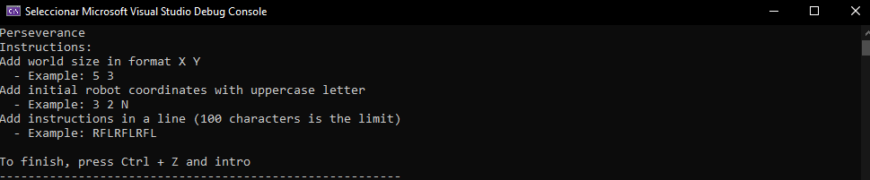
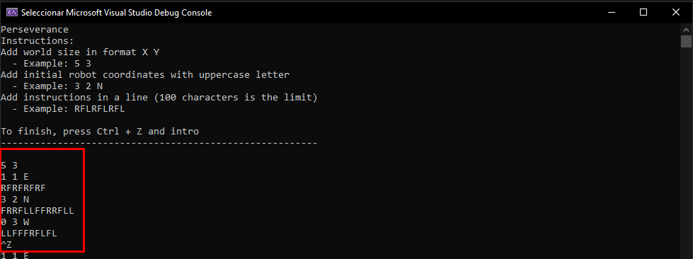
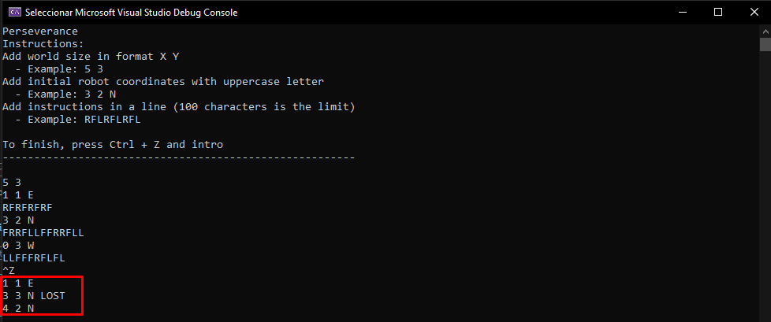

# Perseverance - Code Challenge

## Architectural decisions

- Layer division:
    
    The project is divide in four layers that represent the Console Application, the Application, the Domain and finally the Infrastructure.

    * Console: The user interact with this layer and their only job is to handle the inputs and outputs that the application can read/show to the user.
    * Application: This layer orchestra the logic in the application. This layer create a planet and the rovers instances, execute and return the final result to the console application.
    * Domain: This layer is based in entities and each of these entities contain ther out logic based on the DDD principle.
    * Infrastructure: The only job of this layer is interact with the files and folders to save and read information in .json files.


## How to run it

Open the solution in Visual Studio and press the play button.

A windows terminal will open with the instructions:



### Input 

- The first line is the boundaries of Mars, should be writed in X Y coordinates
- The next two lines are divide en two sections that can be repeated for create a robot instance
    * The initial coordinates and direction of the rover
    * Set of instructions

    This two lines represent a rover.
          
        
Example
```
5 3
1 1 E
RFRFRFRF
3 2 N
FRRFLLFFRRFLL
0 3 W
LLFFFRFLFL
```




### Output

The basic output is a list of the last positions of each rover.

When the rover cross the edge of the planet and "lost" the result will be the last knowed possition and the word "LOST"

